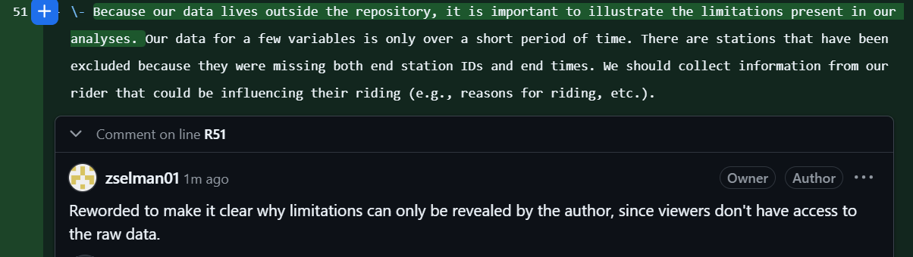

# DATA 501 — Assignment 6 Collaboration Log

**Name: Zaharia Selman**
**NetID: zselman**

## Part 0
*git status*
On branch main
Your branch is up to date with 'secondary/main'.

nothing to commit, working tree clean

*git log --oneline*
017c4da (HEAD -> main, secondary/master, secondary/main) Updated WORKLOG.md
692d227 Added the period back in throw-away branch to diverge from master branch
dd2eee2 Made a change in the throw-away branch (removed a period in a sentence) to complete Part 9: Challenge
50441a2 Commit from cloned branch merged with master branch
7cf5029 Updated WORKLOG.md
f1f8ae4 Add recovery test performed
a5c3a76 Conflict resolved and wording of limitations from master branch was chosen
a38c0fb Add rewording again for limitation about the maximum duration cutoff
738a546 Add rewording for limitation about the maximum duration cutoff
623826e Added analysis code and report file updated to reflect a new minimum duration cutoff for trips
f0a6ee5 Revert "Added exaggerated claim (on purpose for Part 4)"
2a71a5a Added exaggerated claim (on purpose for Part 4)
e3bf2ab Added updated and correct WORKLOG.md file
9686273 Removed extra WORKLOG.md file
c1caefd Add rewording of a limitation in report.md file
0ae202d Add gitignore file that excludes the raw data files from the analysis, Jupyter's autosave files, and scratch/throwaway experiments
05315aa Add worklog of current backing up process
4590767 Add analysis and charts to support answers to ridership questions

**Important Side Note**: Ran several commands to reset a cloned version of my ride-knox-analysis repo since I’ve started working on the project. I wanted to work from the end of Assignment 5 so I ran the following commands (generated from Google; also see AI note below) to get back to this point so I can do everything from this assignment. Also made a new repository on GitHub to push to so none of the changes I’ve made in my project will be affected.
•	git clone https://github.com/zselman01/ride-knox-analysis.git (command)
•	git log -n 1 --until="2026-09-19 00:00:00" --format="%H" (command)
o	    017c4da51650ac85fffa8b87e980a2f20425318b (output)
•	git reset --hard 017c4da51650ac85fffa8b87e980a2f20425318b (command)
o	    HEAD is now at 017c4da Updated WORKLOG.md (output)
•	git branch -m master main (command)
•	git push -u secondary main –force (command)

*Q0*: Module 5 deliberately left the README blank and this assignment will create/finish it so that a stranger who clones our repository can understand what's in it and how to properly use it.

## Part 1
*Issue number and URL*
Issue #1
https://github.com/zselman01/ride-knox-analysis-assignment-6/issues/1#issue-5585519029

*Descriptions of two additional issues (told to paste output of both bodies)*
- Issue #2: The missing end station ids
What / where
There are several trips missing end station ids from bikes that seem to have never been docked. Do we want to remove these rows or flag them?

Expected vs. actual (*Also Q1*)
Expected: 0 rows where end_station_id == NA/null.
Actual: 3,726 rows.

Why it matters
We must decide whether to get rid of these rows or flag them because they exclude necessary information that we need.

- Issue #3: Stray whitespace in start station name
What / where
The stray whitespaces in start station name affect the unique types of station names.

Expected vs. actual
Expected: 24 stations
Actual: 121 stations

Why it matters
They inflate the unique number of stations making it seem like duplicates of the same name are distinct stations.

## Part 2
*git branch output*
* chore/tidy-report
  main

*Commit message*
[chore/tidy-report 07f8c96] Added note about the raw data living outside the repo to the report.md; Cleaned up some other files
 11 files changed, 397 insertions(+), 446 deletions(-)
 delete mode 100644 charts/S25_comparison_2026.png
 delete mode 100644 charts/arrivals_per_dock_2025.png
 delete mode 100644 charts/arrivals_per_dock_2026.png
 delete mode 100644 charts/median_duration_per_rider_type_2026.png
 delete mode 100644 charts/share_by_rider_type_2025.png
 delete mode 100644 charts/share_by_rider_type_2026.png
 delete mode 100644 charts/trips_per_hour_per_rider_type_2026.png
PS C:\Users\selma\Data Science Toolkit\ride-knox-analysis-assignm-6\ride-knox-analysis> git push secondary chore/tidy-report
Enumerating objects: 13, done.
Counting objects: 100% (13/13), done.
Delta compression using up to 8 threads
Compressing objects: 100% (9/9), done.
Writing objects: 100% (9/9), 213.00 KiB | 6.45 MiB/s, done.
Total 9 (delta 4), reused 0 (delta 0), pack-reused 0 (from 0)
remote: Resolving deltas: 100% (4/4), completed with 3 local objects.
remote: 
remote: Create a pull request for 'chore/tidy-report' on GitHub by visiting:
remote:      https://github.com/zselman01/ride-knox-analysis-assignment-6/pull/new/chore/tidy-report
remote: 
To https://github.com/zselman01/ride-knox-analysis-assignment-6
 * [new branch]      chore/tidy-report -> chore/tidy-report

*PR description*
Added note about the raw data living outside the repo to the report.md

*Self-review line comment*

*Q2* At the moment my PR was open but not yet merged, main was untouched and in the same state as of my last merge to it.

## Part 3

*Q3* I instead embedded the charts/trips_per_dock_by_station_2025.png. A relative path matters for someone who clones my repo because they wouldn't have access to the personal paths on my laptop.

## Part 4

*Pull request error banner*
This branch has conflicts that must be resolved
Use the web editor or the command line to resolve conflicts before continuing.

report.md

*Resolve the conflict*
<<<<<<< docs/project-readme
\*\*The Day Pass brought casual riders back. The dock expansion and new station fix the campus crunch. One out of idle stations from 2025 has seen major growth.\*\*
=======
\*\*We are excited to announce that the Day Pass brought casual riders back! The dock expansion and new station fix the campus crunch. One out of two idle stations from 2025 seem to still be sitting idle.\*\*
>>>>>>> main

*Resolved sentence*
We are excited to announce that the Day Pass brought casual riders back! The dock expansion and new station fix the campus crunch. One out of idle stations from 2025 has seen major growth.

## Part 5

## Part 6

## Part 7

## Part 8

## Reflection and AI Disclosure